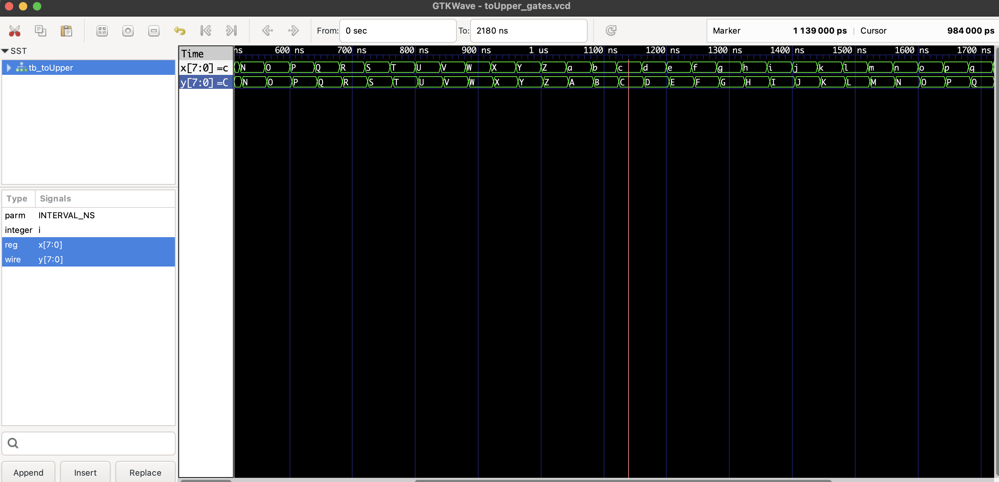
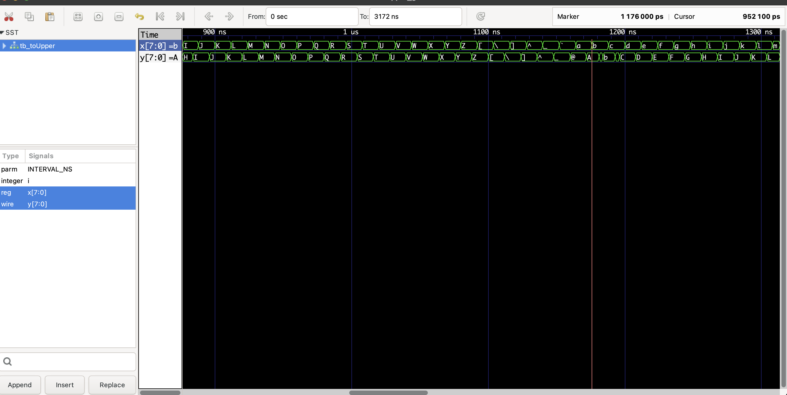
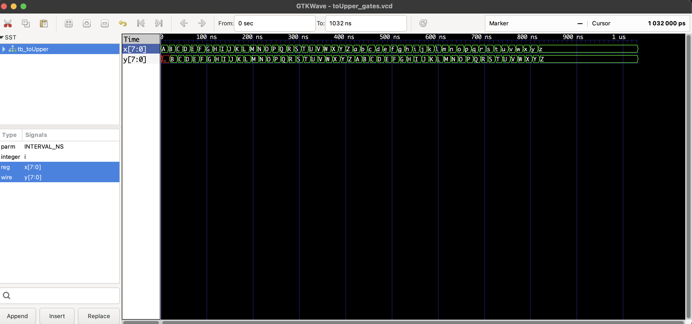

# Project 1 — Gate-Level Implementation of `toUpper()`

Author: Gaurav Banepali  
Course: CSC 211000 – Digital Design  
Date: November 2025

---

## Overview

This project implements the ASCII `toUpper()` operation entirely at the gate level using primitive Verilog logic gates.  
The circuit converts lowercase ASCII letters (`a–z`) to uppercase (`A–Z`) by clearing bit 5 of the input whenever the character falls within the lowercase range.  
All non-lowercase values pass through unchanged.

The project also includes timing analysis to determine the minimum safe input interval based on the circuit’s propagation delays.

---

## Implementation

The module uses only primitive gates with fixed delays:

| Gate Type | Delay | Description |
|----------|--------|-------------|
| NOT      | #5     | Bit inversion |
| AND, OR  | #10    | Basic combinational logic |
| NAND/NOR | #12    | Inverted logic forms |
| XOR/XNOR | #15    | Comparison logic |
| BUF      | #4     | Output buffering |

The core of the design is a minimized sum-of-products expression for output bit `y[5]`, derived from the 16×16 K-map.  
This minimizes the number of AND/OR operations and ensures delay meets the NOT → AND → OR requirement.

**Files included:**
- `toUpper_gates.v` — gate-level module  
- `tb_toUpper_gates.v` — testbench  
- `toUpper_gates.vcd` — waveform dump for GTKWave  
- `wave_40ns.png` — waveform at 40 ns interval (correct behavior)  
- `wave_10ns.png` — minimum passing interval  
- `wave_8ns.png` — failing interval  
- `kmap_y5.png` — handwritten 16×16 K-map  
- `Project1_Report_GauravBanepali.pdf` — full written report  

Simulations were performed using Icarus Verilog (`iverilog`, `vvp`) and GTKWave.

---

## K-Map Analysis (Output Bit y₅)

A complete 16×16 K-map was constructed using all 8 input bits in Gray-code order.  
Each cell contains the value of output bit `y₅` for the corresponding ASCII input.

Rules for filling the map:

- If bit 5 (`x₅`) is **0** → output is **0**.  
- If bit 5 is **1** → output is normally **1**.  
- If the value is lowercase ASCII (97–122) → output must be **0**, so these cells were forced to 0.

This method avoids needing a separate lowercase-detection circuit and directly produces the minimized SOP form.

**Handwritten K-map:**  
`kmap_y5.png`

---

## Simulation Results

The design was tested across multiple input intervals to check timing stability:

| Interval (ns) | Behavior |
|---------------|----------|
| 40            | Correct behavior |
| 20            | Correct behavior |
| 12            | Correct behavior |
| 10            | Minimum passing interval |
| 8             | Failing interval (unstable output) |

**Waveform Images:**

### 40 ns (Correct)

### 10 ns (Minimum Passing)

### 8 ns (Failing)

---

## Observations

- The minimized K-map expression resulted in fewer gates and cleaner timing.  
- The worst-case propagation delay matches the expected chain of NOT → AND → OR.  
- The circuit operates correctly for all ASCII values when the interval is **≥ 10 ns**.  
- At **8 ns**, the output becomes unstable due to overlapping gate delays.

---

## Conclusion

This project demonstrates a hardware-based implementation of ASCII uppercase conversion using only primitive gates.  
The K-map approach ensures full correctness for every input value, and the timing tests confirm the circuit’s maximum safe operating speed.  
The result is a clean, optimized gate-level design suitable for digital hardware environments.

---

## Repository Contents

verilog-toUpper/
│
├── toUpper_gates.v
├── tb_toUpper_gates.v
├── toUpper_gates.vcd
├── wave_40ns.png
├── wave_10ns.png
├── wave_8ns.png
├── kmap_y5.png
├── Project1_Report_GauravBanepali.pdf
└── README.md
